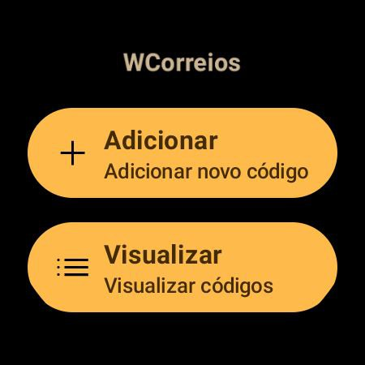
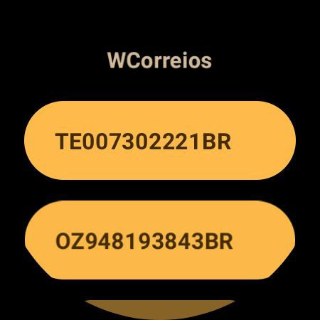
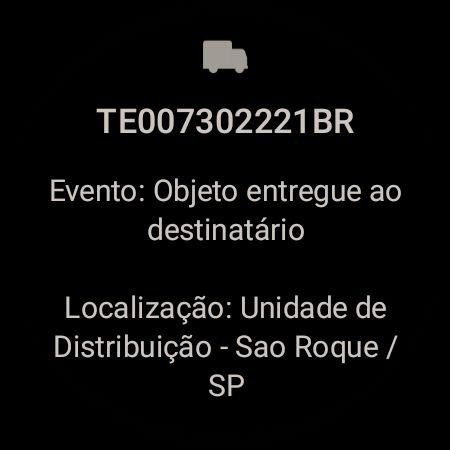

# WCorreios
Wear OS app for track Correios objects.

<p align="center">
  
</p>

# Features
* Track Correios objects

<p align="center" width="100" >
  
  
  
</p>

# Prerequisites
* [Android Studio](https://developer.android.com/studio)

# Running
### 1. Run
````
# Import Project on Android Studio
Open an existing Android Studio project > WCorreios.

# Start
Run > Run 'app'.
````

# Built With
* [Kotlin](https://kotlinlang.org/)

# Authors
* [xxgicoxx](https://github.com/xxgicoxx)

# Acknowledgments
* [FlatIcon](https://www.flaticon.com/)
